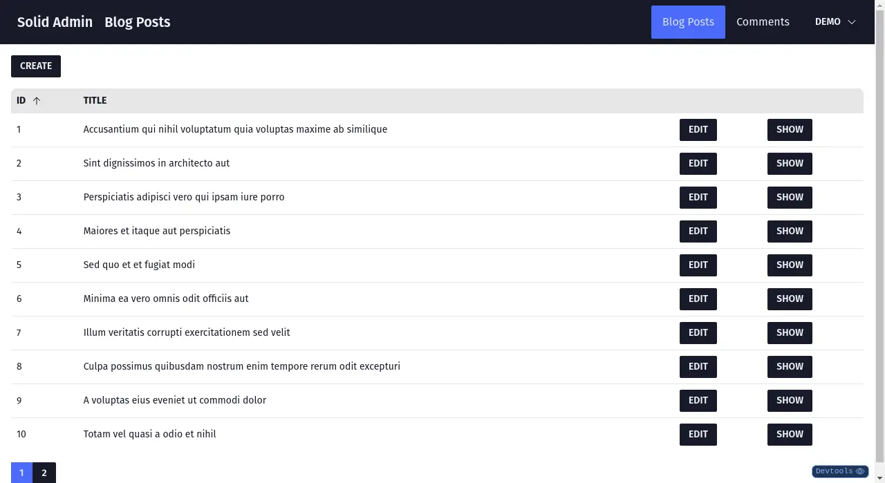

# `<Datagrid>`

The `<Datagrid>` component is responsible for displaying a list of records.

It leverages the `ListContext` provided by the [`<List>`](./List.md) component to get its data and supports pagination and sorting.

It is built with [tanstack/table](https://tanstack.com/table/v8).

## Props

- `columns`: Required. The [columns configuration](https://tanstack.com/table/v8/docs/guide/column-defs)

## Example

```jsx
import { CreateButton, DataGrid, EditButton, List, ShowButton, TextField } from '@solid-admin/admin';

const PostColumns = [
	{
		accessorKey: 'id',
		header: 'ID',
		cell: () => <TextField source="id" />,
	},
	{
		accessorKey: 'title',
		header: 'Title',
		cell: () => <TextField source="title" />,
	},
	{
		accessorKey: 'edit',
		header: '',
		cell: () => <EditButton />,
	},
	{
		accessorKey: 'show',
		header: '',
		cell: () => <ShowButton />,
	},
];

export const PostList = () => {
	return (
		<List>
			<DataGrid columns={PostColumns} />
		</List>
	);
};
```


